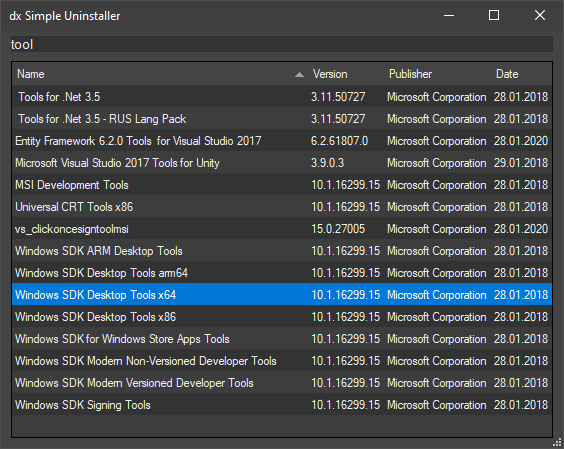

# dx Simple Uninstaller
Simple GUI script to uninstall your Windows applications. 

The tool contains ~100 lines of code, written in PowerShell. The stuff bundled in:

- Dark WPF UI theme
- Registry parser
- Uninstall command parser and invoker
- Filtering and sorting around the data

## Why?
Windows Core (Server, no UI version) does not have any visual interface for the uninstallation of applications on the target machine. But it can be handy if you creating an application installer and want to verify it on the server.

Or maybe you just need easy and fast access to uninstall? :blush:

## How does it work
The tool gets the list of the entries in the registry: HKLM:\Software\Wow6432Node\Microsoft\Windows\CurrentVersion\Uninstall\

The uninstall command can be like this: `MsiExec.exe /I{bla-blah}`, i.e. "Do you want to uninstall or modify?". Windows Core does not like it and runs nothing. So the format is automatically changed to: `MsiExec.exe /X{bla-blah}`,  i.e. "Uninstall this app?"

Then uninstall command invoked. No additional folders cleaning etc - do just what uninstaller do.

## Files
The tool is a single file only: `dxSimpleUninstaller.ps1`. Other files help to use it easier:

- .bat/.vbs helps you to run the tool since double click on ps1-file will not work by default
- .ico/.svg/.png are icons. You will need it if you want to add a tool into TotalCommander's toolbar for example.

## Credits:
Developed by Dmitry Hrabrov a.k.a. DeXPeriX and every direct or indirect contributor to the GitHub.

## License:
This software is dual-licensed to the public domain and under the following license: you are granted a perpetual, irrevocable license to copy, modify, publish and distribute this file as you see fit